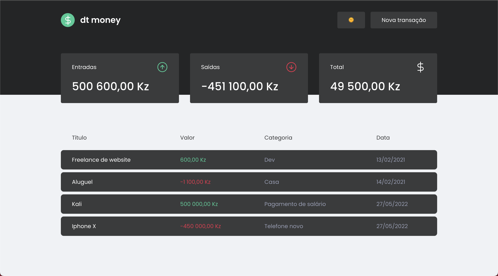

<h1>Dt Money</h1>

<p align="center">
  <a href="#-tecnologias">Tecnologias</a>&nbsp;&nbsp;&nbsp;|&nbsp;&nbsp;&nbsp;
  <a href="#-projeto">Projeto</a>&nbsp;&nbsp;&nbsp;|&nbsp;&nbsp;&nbsp;
</p>

<br />

<p align="center">
  
</p>

## 🚀 Tecnologias

Esse projeto foi desenvolvido com as seguintes tecnologias:

- React.js
- Typescript
- Styled Components
- Miragejs
- Axis
- React Hooks

## 💻 Projeto

Neste projeto foi desenvolvida uma aplicação de controle de transações, tanto como entrada como saída de dados. Usei uma modal para a introdução dos dados e a possibilidade de alterar o tema da aplicação para o dark mode 😎

## 🪄 Instalação 
Com o [yarn](https://yarnpkg.com/) ou algum outro gerenciador de pacotes instalados no seu computador, execute os seguintes comandos para executar a aplicação no seu computador.

```bash
1 - yarn
2 - yarn start  
```
---

Feito com ♥ by Daniel Koti